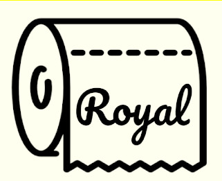
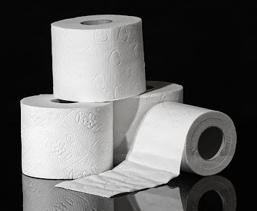
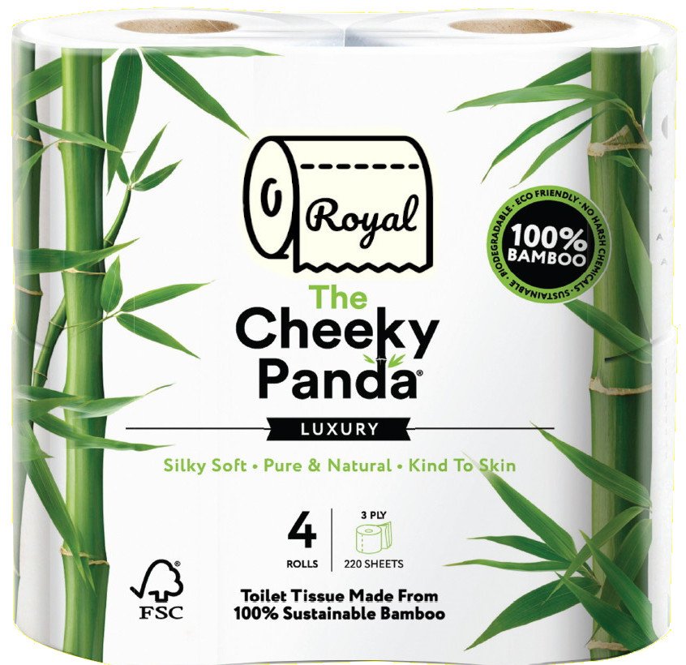
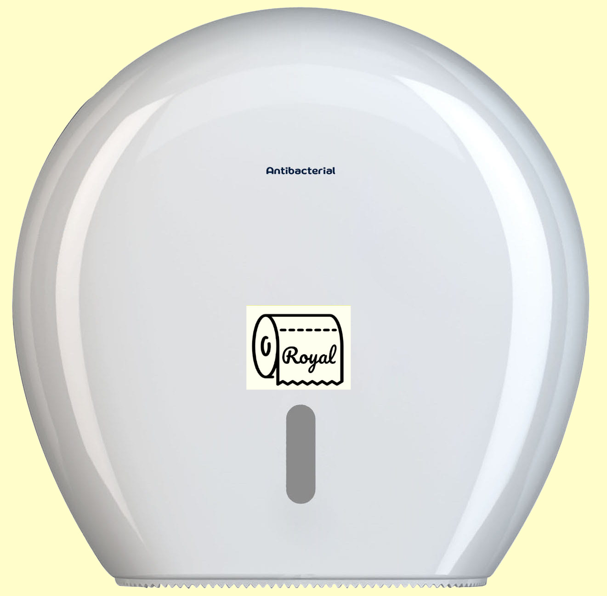

<!DOCTYPE html>
<html lang="pl">

<head>
    <meta charset="UTF-8">
    <meta name="viewport" content="width=device-width, initial-scale=1.0">
    <link href="https://fonts.googleapis.com/css?family=Pacifico&display=swap" rel="stylesheet">
    <link href="https://fonts.googleapis.com/css?family=Fredoka+One&display=swap" rel="stylesheet">
    <link href="https://fonts.googleapis.com/css?family=Lato:400,700&display=swap" rel="stylesheet">
    <link rel="stylesheet" href="./style123.css">
    <title>Papier Toaletowy Royal</title>
</head>

<body>
    
Royal

    

        
        <nav>
            <ul class="navb">
                <li><a href="index.html">Strona Główna</a></li>
                <li><a href="index.html">O nas</a></li>
                <li><a href="index.html">Produkty</a></li>
                <li><a href="index.html">Kontakt</a></li>
            </ul>
        </nav>
    

    

        <h1>O nas</h1>
        
        <h3>Jesteśmy czołowym producentem papieru toaletowego</h3>Lorem ipsum dolor shit amet consectetur adipisicing
        elit. Nihilizm quae adipisci placeat ratione neque dolore, impedit doloribus, totam nostrum pariatur iste nobis,
        obcaecati minima essa laborum a repudiandae eligendi vero?
        

        <h1 class="prod">Produkty</h1>
        

            

                Papier toaletowy z bambusa Cheeky Panda
                
                
14,95 zł

            

            
Pojemnik na papier toaletowy anibacterial
35,89 zł

            

            
Papier toaletowy sto złotych   
19,99 zł
 

        

    

    

    

        
Jesteśmy tutaj!

        <iframe class="mapa"
            src="https://www.google.com/maps/embed?pb=!1m18!1m12!1m3!1d1787.5461408863384!2d17.8738478784102!3d50.68334481738311!2m3!1f0!2f0!3f0!3m2!1i1024!2i768!4f13.1!3m3!1m2!1s0x4710527d12664337%3A0xbe624bba5d312229!2sPark%20Naukowo-Technologiczny%20w%20Opolu!5e0!3m2!1spl!2spl!4v1584882340684!5m2!1spl!2spl"
            width="700" height="350" frameborder="0" style="border:0;" allowfullscreen="" aria-hidden="false"
            tabindex="0"></iframe>
        

        
Kontakt

        

            

                
Technologiczna 2, 45-839 Opole

                
royal.soft@clean.com

                
+48 696 420 666

            

            <form>
                <input class="iin" type="text" placeholder="Imię i nazwisko">
                <input class="ein" type="email" placeholder="E-mail">
                <input class="txtf" type="text" placeholder="Napisz wiadomość!">
            </form>
        

    

</body>

</html>